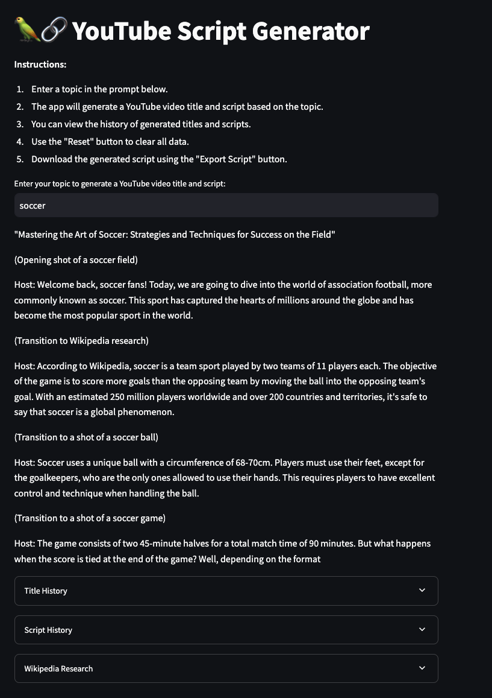

# 🦜🔗 YouTube Script Generator

A Streamlit-powered web application that generates YouTube video titles and scripts based on user-provided topics. This app leverages OpenAI's large language models via LangChain and incorporates Wikipedia research to create engaging and informative content.

## Features

- **Title Generation**: Generates YouTube video titles based on the input topic.
- **Script Generation**: Creates detailed YouTube video scripts using the generated title and supplemental Wikipedia research.
- **Memory Buffer**: Tracks the history of generated titles and scripts.
- **User-Friendly Interface**: Includes clear instructions and formatted outputs for better readability.

Preview:

 
